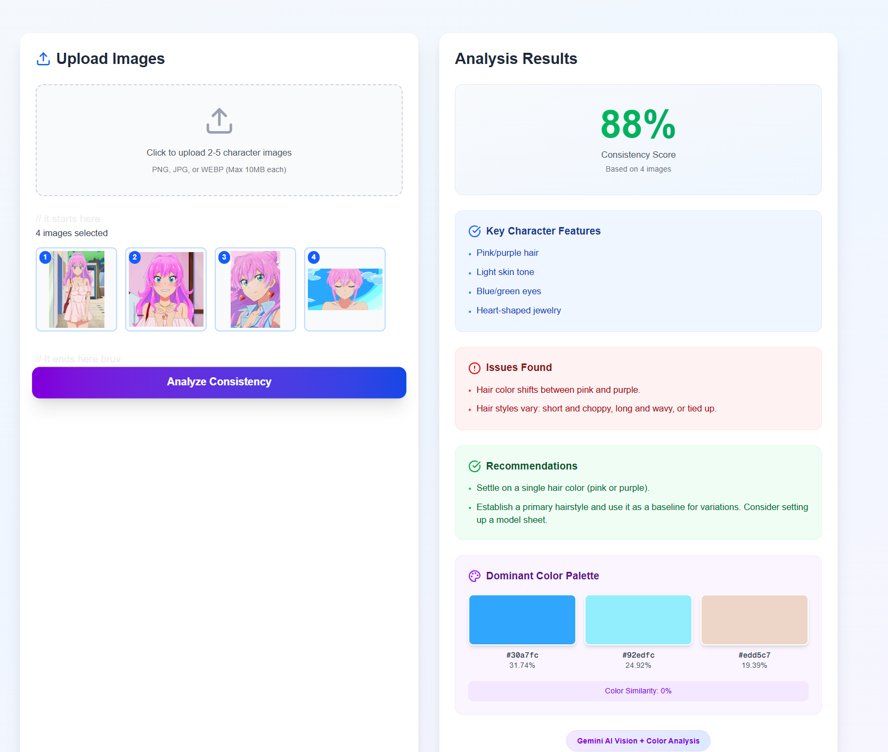
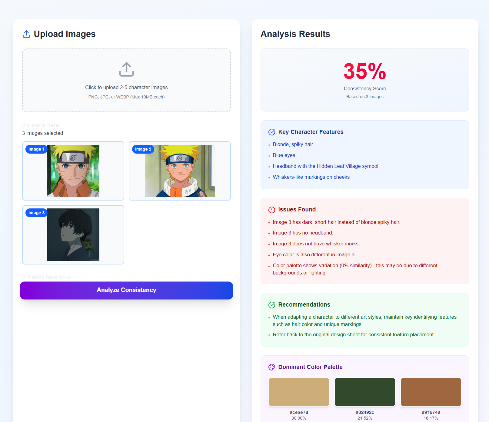
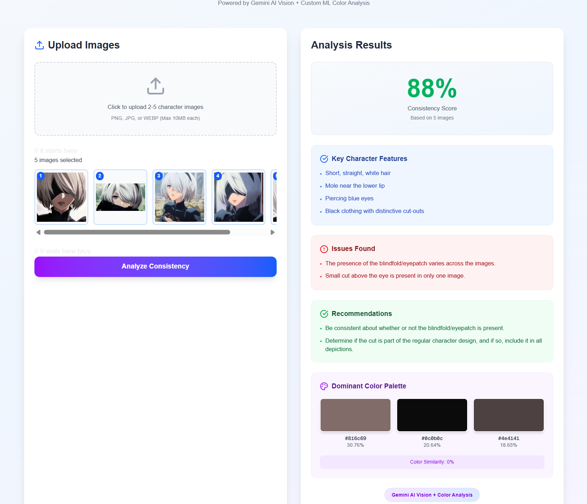

# AI Character Consistency Checker

An AI-powered tool that helps anime artists and character designers maintain visual consistency across multiple character designs.









🔗 **Live Demo:** https://character-checker.vercel.app

---

## 🎯 What It Does

Upload 2-5 images of your character and get:
- **Consistency Score** (0-100) based on AI analysis
- **Key Character Features** - Defining traits to maintain
- **Issues Detected** - Specific inconsistencies found
- **Recommendations** - Actionable tips to improve consistency
- **Color Palette Analysis** - Dominant colors with percentages

---

## 🛠️ Tech Stack

**Frontend:**
- Next.js 14 (React, TypeScript)
- Tailwind CSS
- Lucide Icons

**Backend:**
- FastAPI (Python)
- Google Gemini 2.0 Flash (Vision AI)
- Custom K-means color extraction (scikit-learn)

**Deployment:**
- Frontend: Vercel
- Backend: Railway

---

## 🚀 How It Works

1. **Upload** 2-5 character images
2. **AI Analysis** using Gemini Vision API
   - Analyzes facial features, proportions, style
   - Identifies character-defining traits
   - Detects inconsistencies
3. **Color Extraction** using K-means clustering
   - Extracts dominant color palette
   - Compares color consistency across images
4. **Results** delivered in clean, actionable format

---

## 💡 Use Cases

- Character designers ensuring consistency across poses
- Animation studios validating character sheets
- Comic artists maintaining character recognition
- Game developers checking character design variants
- Art students learning character design principles

---

## 🎨 Features

Multi-image analysis (2-5 images per batch)
AI-powered feature detection
Custom ML color palette extraction
Detailed consistency scoring
Specific issue identification
Actionable recommendations
Visual color palette display

---

## 📝 Known Limitations & Future Improvements

### Current MVP Constraints:
- Best suited for character-focused images
- Works optimally with similar backgrounds/lighting
- Text-heavy images may affect analysis accuracy
- Limited to 2-5 images per analysis

### Planned Improvements:
- [ ] Background removal for better character focus
- [ ] Batch processing for larger sets
- [ ] Export analysis as PDF
- [ ] Character comparison across art styles
- [ ] Figma plugin integration
- [ ] Advanced prompt hardening

---

## 🏃‍♂️ Running Locally

### Backend Setup
```bash
cd backend
python -m venv venv
source venv/bin/activate  # Windows: venv\Scripts\activate
pip install -r requirements.txt

# Create .env file with:
# GOOGLE_API_KEY=your_gemini_api_key

python main.py
```

Backend runs on `http://127.0.0.1:8000`

### Frontend Setup
```bash
cd frontend
npm install

# Create .env.local with:
# NEXT_PUBLIC_API_URL=http://127.0.0.1:8000

npm run dev
```

Frontend runs on `http://localhost:3000`

---

## 🔑 Environment Variables

**Backend (.env):**
```
GOOGLE_API_KEY=your_gemini_api_key_here
```

**Frontend (.env.local):**
```
NEXT_PUBLIC_API_URL=your_backend_url_here
```

---

## 📦 Project Structure
```
character-checker/
├── backend/
│   ├── main.py              # FastAPI app with AI analysis
│   ├── requirements.txt     # Python dependencies
│   ├── .env.example        # Environment template
│   └── Procfile            # Railway deployment config
├── frontend/
│   ├── app/
│   │   └── page.tsx        # Main UI component
│   ├── package.json        # Node dependencies
│   └── tailwind.config.ts  # Tailwind configuration
└── README.md
```

---

## 🎓 What I Learned

Building this project taught me:
- Integrating modern AI APIs (Gemini Vision)
- Full-stack development (Next.js + FastAPI)
- ML implementation (K-means clustering)
- Prompt engineering for consistent AI outputs
- Production deployment (Railway + Vercel)
- Handling images and file uploads
- Managing environment variables securely
- Trade-offs between MVP and production features

---


## 📄 License

MIT License - feel free to use this for learning or building upon!

---

## 👤 Author

Built by Elijah as part of my journey into AI Engineering.

- 🐦 Twitter: @hxdlab: https://x.com/hxdlab/


https://character-checker.vercel.app
